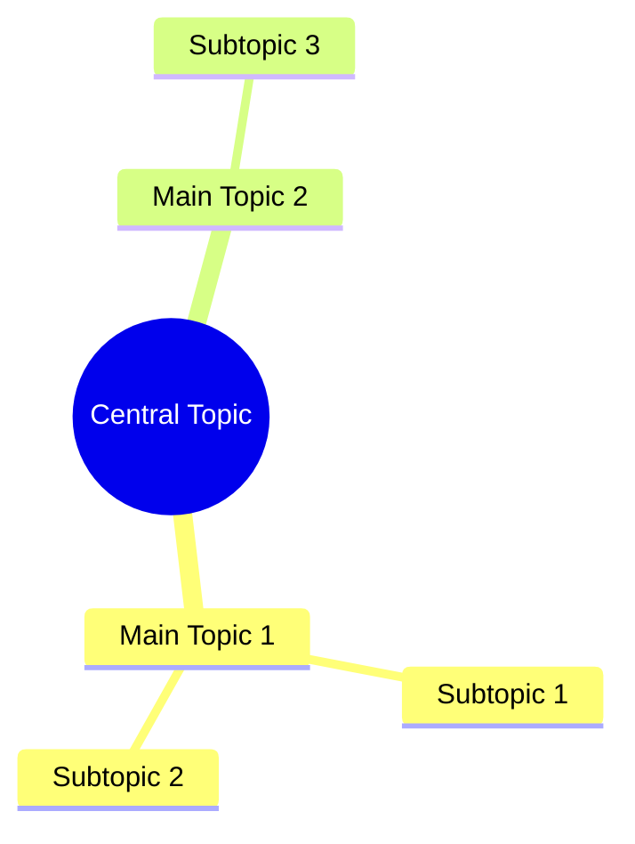

# XMinder

An [Obsidian](https://obsidian.md) plugin for reading, writing, and embedding [XMind](https://www.xmind.net) files directly inside your vault. Powered by [mind-elixir](https://github.com/SSShooter/mind-elixir-core).

**[中文](README.zh.md)**

### Introduction

XMinder brings full XMind mind map support to Obsidian. Open `.xmind` files as interactive, editable mind maps without leaving your note-taking workflow. Changes are auto-saved back to the original `.xmind` format, keeping your files compatible with the XMind desktop application.

### Features

- **File Explorer integration** — `.xmind` files appear in Obsidian's file tree; click to open
- **Interactive mind map editor** — add, edit, delete, and drag-and-drop nodes with full undo/redo support
- **Multi-sheet support** — switch between multiple canvases within a single `.xmind` file via a dropdown selector
- **Canvas panning** — toggle drag mode from the left toolbar to pan the canvas with left-click
- **Auto-save** — changes are written back to the `.xmind` file after a configurable debounce delay (default 500 ms)
- **Manual save** — `Ctrl/Cmd + S` saves immediately
- **Markdown embed** — use `![[diagram.xmind]]` to render a read-only interactive preview inline in any note
- **Markdown link** — use `[[diagram.xmind]]` to create a clickable link that opens XMind view
- **Export to Mermaid mindmap** — export mind map as Mermaid format copied to clipboard (can be pasted directly into notes for rendering)
- **Open with XMind app** — right-click menu option to open `.xmind` files with external XMind application (configurable in settings)
- **Theme follow** — automatically switches between light and dark themes with Obsidian
- **Responsive layout** — automatically re-fits the view when splitting or resizing panes
- **XMind format compatibility** — supports both `content.json` (XMind 8+ / ZEN) and legacy `content.xml` formats
- **Cross-platform** — works on macOS, Windows, Linux, and Obsidian Mobile

### Usage

#### Opening an XMind file

- **click** any `.xmind` file in the file explorer
- **Right-click** a `.xmind` file → *Open as XMind* (opens with external XMind app, configurable)
- **Right-click** a folder → *Create New XMind Mindmap* (creates a new XMind file in the selected folder)
- Run the command: `XMinder: Create new XMind file`

#### Embedding in a Markdown note

```markdown
# Inline read-only preview (click to open full editor)
![[my-diagram.xmind]]

# Clickable link that opens the XMind view
[[my-diagram.xmind]]
```

#### Export to Mermaid Mindmap

The exported Mermaid mindmap format can be pasted directly into notes, and the Mermaid plugin will automatically render it as a visual mind map:

```markdown

```

#### Toolbar

**Left toolbar** (top-left corner):

| Button | Description |
|--------|-------------|
| Hand / Pointer | Toggle canvas drag mode |
| Crosshair | Center and focus on root node |
| Question mark | Show keyboard shortcuts |

**Right-bottom toolbar**:

| Button | Description |
|--------|-------------|
| Zoom out | Decrease zoom level |
| Zoom in | Increase zoom level |
| Reset | Fit diagram to view and center |
| Fullscreen | Toggle fullscreen mode |

#### Keyboard Shortcuts

| Shortcut | Action |
|----------|--------|
| `Tab` | Add child node |
| `Enter` | Add sibling node |
| `Ctrl+C` | Copy |
| `Ctrl+V` | Paste |
| `Ctrl+Z` | Undo |
| `Ctrl+S` | Save |

#### Commands (Command Palette)

| Command | Description |
|---------|-------------|
| `XMinder: Create New XMind File` | Creates a new blank `.xmind` file and opens it |
| `XMinder: Export XMind as Mermaid Mindmap` | Exports as Mermaid mindmap to clipboard (can be pasted directly into notes for rendering) |
| `XMinder: Fit XMind View` | Resets zoom and centers the diagram |
| `XMinder: Save XMind File` | Saves immediately |

#### Settings

Open *Settings → Community Plugins → XMinder*:

| Setting | Default | Description |
|---------|---------|-------------|
| Auto-save Delay | `500` ms | Time to wait after the last edit (milliseconds) before auto-saving the .xmind file. Set to `0` to disable auto-save. |
| Embed Preview Height | `320` px | Height of embedded mind map previews (in pixels) when using ![[file.xmind]] in notes. |
| Show "Open with XMind" menu | On | Show "Open with XMind" in the file context menu to open .xmind files with the external XMind application. Recommended if XMind app is installed. |

---

### Build & Deployment

#### Prerequisites

| Tool | Minimum version |
|------|----------------|
| Node.js | 16.x |
| npm | 7.x |

#### Project Structure

```
obsidian-xminder/
├── src/
│   ├── main.ts                  # Plugin entry point
│   ├── settings.ts              # Settings definition and UI tab
│   ├── xmind/
│   │   ├── types.ts             # Internal type definitions
│   │   ├── parser.ts            # .xmind → XMindData (ZIP + JSON/XML)
│   │   └── serializer.ts        # XMindData → .xmind (ZIP)
│   ├── views/
│   │   └── XMindView.ts         # FileView with mind-elixir renderer + custom layout
│   └── markdown/
│       └── EmbedProcessor.ts    # ![[]] / [[]] post-processor
├── dist/                        # Production build output
│   ├── main.js
│   ├── manifest.json
│   └── styles.css
├── styles.css                   # Source stylesheet
├── manifest.json                # Obsidian plugin manifest
├── package.json
├── tsconfig.json
└── esbuild.config.mjs           # Build configuration
```

#### Install Dependencies

```bash
npm install
```

#### Development Build (watch mode)

```bash
npm run dev
```

To test with Obsidian, symlink the plugin folder into your vault:

```bash
ln -s /path/to/obsidian-xminder \
  "/path/to/your/vault/.obsidian/plugins/obsidian-xminder"
```

Then enable the plugin in *Settings → Community Plugins* and reload Obsidian after each change (`Cmd+R` / `Ctrl+R`).

#### Production Build

```bash
npm run build
```

Output in `dist/`:

```
dist/
├── main.js        # Bundled plugin (all dependencies inlined)
├── manifest.json
└── styles.css
```

Clean build (removes `dist/` first):

```bash
npm run build:clean
```

#### Deployment (Manual Install)

1. **Build the plugin**:

   ```bash
   npm install && npm run build
   ```

2. **Copy to your vault**:

   ```bash
   mkdir -p "<your-vault>/.obsidian/plugins/obsidian-xminder"
   cp dist/{main.js,manifest.json,styles.css} \
     "<your-vault>/.obsidian/plugins/obsidian-xminder/"
   ```

3. **Enable the plugin** in *Settings → Community Plugins*

#### Key Dependencies

| Package | Purpose |
|---------|---------|
| [mind-elixir](https://github.com/SSShooter/mind-elixir-core) | Interactive mind map renderer |
| [jszip](https://stuk.github.io/jszip/) | Read/write `.xmind` ZIP archives |
| [obsidian](https://github.com/obsidianmd/obsidian-api) | Obsidian plugin API |
| [esbuild](https://esbuild.github.io/) | Bundler |
| [typescript](https://www.typescriptlang.org/) | Type checking |

#### Platform Support

| Platform | Status |
|----------|--------|
| macOS | ✅ Fully supported |
| Windows | ✅ Fully supported |
| Linux | ✅ Fully supported |
| Obsidian Mobile (iOS / Android) | ✅ Supported |

---

### XMind File Format

`.xmind` files are ZIP archives. This plugin reads and writes:

| Entry | Format | Version |
|-------|--------|---------|
| `content.json` | JSON array of sheets | XMind 8+ / ZEN (preferred) |
| `content.xml` | XML document | Legacy (read-only) |
| `metadata.json` | JSON | Written on save |

Files in `content.xml` format are upgraded to `content.json` on first save.

### License

MIT
